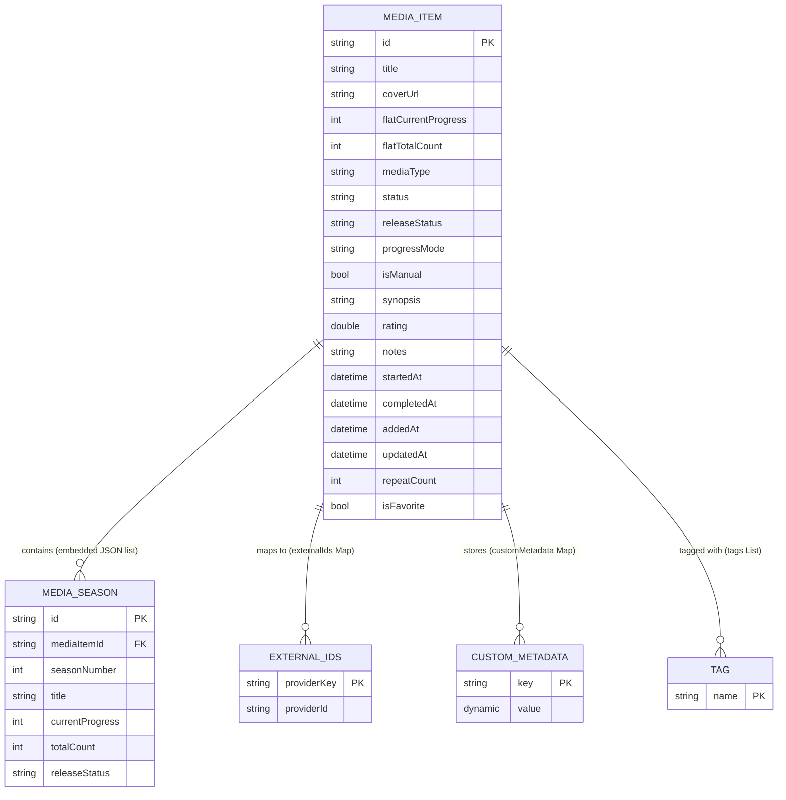

# Episode Sync & FastAPI Backend Discovery Report

> **Document Status:** Authoritative Discovery & Architectural Blueprint  
> **Target Project:** Episode Flutter Application  
> **Output Specification:** Technical discovery report for offline-first data sync & FastAPI backend design  
> **Verification Date:** 2026-08-02  

---

## 1. Project Overview

### 1.1 Executive Summary
Episode is a cross-platform Flutter application designed to track anime, manga, TV series, and movies in a local media collection. The application is strictly offline-first, operating without cloud servers or required user accounts. All user data is currently stored on-device via `SharedPreferences` in plaintext JSON arrays. The app integrates with external REST APIs (Jikan for Anime/Manga, TVMaze for TV Series) for media discovery and provides local file backup/restore capabilities (Native JSON, MyAnimeList XML, CSV).

### 1.2 Core Stack & Versions
* **Application Name:** Episode (`pubspec.yaml` `name: episode`, version `1.0.0+1`)
* **Application Purpose:** Local media collection tracking, remote media search, metadata editing, flat and multi-season progress management, and file-based data transfer.
* **Flutter Version:** `3.44.8` (stable)
* **Dart Version:** `3.12.2` (SDK constraint: `>=3.0.0 <4.0.0`)
* **Supported Platforms:** 
  * **Android:** Configured directory and native Storage Access Framework (SAF) MethodChannel adapter (`android/app/src/main/kotlin/com/example/episode/MainActivity.kt`).
  * **Web:** Production browser build validated (`web/index.html`, `lib/services/file_transfer_web.dart`).
  * **iOS, macOS, Windows, Linux:** Unsupported (No platform runner directories in repository).
* **State Management:** Widget-local state (`StatefulWidget`, `setState`, and explicit constructor callbacks). No external state package (Bloc, Riverpod, Provider, GetX, etc.).
* **Dependency Injection:** Manual constructor parameter injection with default fallback instantiations. No DI container (`get_it`, `injectable`).
* **Navigation:** Native Flutter imperative routing (`MaterialApp.home`, `BottomNavigationBar` with `IndexedStack` for primary tabs, and `Navigator.push(MaterialPageRoute(...))` for detail and modal flows).
* **Local Persistence:** `shared_preferences` (active store). `hive`, `hive_flutter`, and `path_provider` are declared in `pubspec.yaml` but are **completely unused** in `lib/`.
* **Networking:** `http` (`^1.2.0`) via a custom `ApiService` wrapper.
* **Current Architectural Pattern:** Technical-responsibility layered architecture (`screens`, `widgets`, `models`, `repositories`, `services`, `data`, `theme`).

### 1.3 Package Inventory (`pubspec.yaml`)
| Package Name | Version Constraint | Type | Role in Project |
| :--- | :--- | :--- | :--- |
| `flutter` | SDK | Dependency | UI framework & core platform APIs |
| `cupertino_icons` | `^1.0.8` | Dependency | iOS icon assets |
| `http` | `^1.2.0` | Dependency | REST client for Jikan and TVMaze |
| `shared_preferences` | `^2.5.5` | Dependency | Active key-value persistence for media library, backups, and history |
| `hive` | `^2.2.3` | Dependency | **Unused** persistence library |
| `hive_flutter` | `^1.1.0` | Dependency | **Unused** Hive Flutter extension |
| `path_provider` | `^2.1.6` | Dependency | **Unused** path lookup utility |
| `archive` | `^4.0.9` | Dependency | GZip decoding for compressed MAL XML exports (`.xml.gz`) |
| `crypto` | `^3.0.7` | Dependency | SHA-256 integrity checksum generation for native backups |
| `web` | `^1.1.1` | Dependency | Browser file pick & download interop for web target |
| `xml` | `^7.0.1` | Dependency | Parsing and generating MyAnimeList XML files |
| `flutter_test` | SDK | Dev Dependency | Unit and widget testing framework |
| `flutter_lints` | `^3.0.0` | Dev Dependency | Analyzer lint rules |

### 1.4 Directory Structure (Data & Architecture Relevant)
```text
Episode/
├── lib/
│   ├── main.dart                          # Application entry point & ThemeMode ownership
│   ├── data/
│   │   └── mock_data.dart                 # Initial 8-item first-run seed library
│   ├── models/
│   │   ├── media_item.dart                # MediaItem, MediaSeason, Enums (MediaType, TrackingStatus, etc.)
│   │   └── data_transfer.dart             # Import/Export contracts, transfer history, & backup records
│   ├── repositories/
│   │   ├── local_storage_repository.dart  # Active SharedPreferences CRUD & snapshot rollback
│   │   ├── media_transfer_repository.dart # Import/export orchestration, preview, & safety backups
│   │   └── search_repository.dart         # Remote discovery boundary
│   ├── services/
│   │   ├── api_service.dart               # Jikan (v4) & TVMaze REST mappers
│   │   ├── csv_export_service.dart        # UTF-8 BOM CSV export provider
│   │   ├── file_transfer_service.dart     # Conditional platform file I/O bridge
│   │   ├── file_transfer_io.dart          # Android SAF file adapter implementation
│   │   ├── file_transfer_web.dart         # Web browser file adapter implementation
│   │   ├── file_transfer_stub.dart        # Unsupported platform fallback
│   │   ├── import_planner.dart            # Matching (ID/title/fuzzy), merge rules, conflict policy
│   │   ├── mal_xml_service.dart           # MyAnimeList XML/GZ import & export provider
│   │   └── native_backup_service.dart     # Episode native JSON codec, SHA-256 integrity, & v0->v1 migration
│   ├── screens/
│   │   ├── main_navigation_screen.dart    # Tab shell & in-memory library state container
│   │   ├── home_tab.dart                  # Home library view, search/type filters, quick increment
│   │   ├── search_tab.dart                # Remote discovery (Explore tab)
│   │   ├── profile_tab.dart               # Settings dashboard & theme switch
│   │   ├── media_detail_screen.dart       # Detailed item editor & deletion
│   │   ├── manual_media_screen.dart       # Manual entry creation form
│   │   ├── data_management_screen.dart    # Backup/Restore/Import/Export dashboard
│   │   ├── import_preview_screen.dart     # Import strategy & conflict policy preview
│   │   └── transfer_history_screen.dart   # Audit trail of imports/exports & safety backups
│   ├── theme/
│   │   └── app_theme.dart                 # Material 3 light/dark themes & tokens
│   └── widgets/
│       ├── media_card.dart                # Reusable media item display card
│       └── season_editor_dialog.dart      # Shared season add/edit dialog
├── test/                                  # 15 test files (79 unit & widget tests)
│   ├── fixtures/                          # Test XML fixtures for MAL import testing
│   └── ...
├── android/                               # Native Android runner & MainActivity.kt SAF implementation
├── web/                                   # Web bootstrap index.html
├── AGENTS.md                              # Repository guidelines & architectural constraints
├── BACKUP_SCHEMA.md                       # Native backup schema specification (v1)
└── pubspec.yaml                           # Dependency manifest & Flutter metadata
```

---

## 2. Current Local Storage Architecture

### 2.1 Storage Technology Breakdown
All persistence in Episode relies on `SharedPreferences` (`shared_preferences: ^2.5.5`), instantiated lazily via `SharedPreferences.getInstance()`.

| Storage Key | Storage Technology | Format | Encryption | Retention / Limit | Role |
| :--- | :--- | :--- | :--- | :--- | :--- |
| `episode_media_items` | `SharedPreferences` | Plaintext JSON Array | None | Unbounded | Authoritative active media library store |
| `episode_automatic_backups_v1` | `SharedPreferences` | Plaintext JSON Array | None | Max 5 records (FIFO) | Automatic pre-import safety snapshots |
| `episode_transfer_history_v1` | `SharedPreferences` | Plaintext JSON Array | None | Max 25 records (FIFO) | Transfer audit log summaries |

### 2.2 Detailed Storage Mechanics (`lib/repositories/local_storage_repository.dart`)

* **Initialization:** `LocalStorageRepository._getPrefs()` retrieves the singleton `SharedPreferences` instance asynchronously.
* **Read Flow (`loadMediaItems`):**
  1. Requests string from `_storageKey` (`episode_media_items`).
  2. If null (first run), seeds `sampleMediaItems` from `lib/data/mock_data.dart`, writes them to storage, and returns them.
  3. If present, decodes JSON string into `List<dynamic>`.
  4. Maps each element via `MediaItem.fromMap(Map<String, dynamic>.from(entry))`.
  5. Validates library integrity (`_validateLibrary`): verifies every item has non-empty `id` and `title`, and enforces uniqueness of `id` across the list.
  6. If JSON is invalid or duplicate IDs exist, throws `StorageCorruptionException` without overwriting stored data.
* **Write Flow (`saveAllMediaItems`):**
  1. Validates the candidate list (`_validateLibrary`).
  2. Encodes entire list to JSON: `jsonEncode(items.map((i) => i.toMap()).toList())`.
  3. Executes `prefs.setString(_storageKey, jsonString)`.
  4. Throws `StorageWriteException` if `setString` returns `false`.
* **Update Flow (`updateMediaItem` / `saveMediaItem`):**
  1. Loads full `List<MediaItem>` into memory.
  2. Searches for target index by `id` (or case-insensitive title match in `saveMediaItem`).
  3. Replaces or inserts item at index 0.
  4. Re-encodes and writes the **entire** array back to `SharedPreferences`.
* **Atomic Whole-Library Replacement (`replaceAllMediaItemsAtomically`):**
  1. Snapshots existing raw string from `_storageKey`.
  2. Writes candidate library JSON to `_storageKey`.
  3. Executes optional `transactionValidator` callback.
  4. Reads stored JSON back from `_storageKey`, decodes it, and performs round-trip equality validation.
  5. If validation or writing fails, automatically restores the snapshotted raw string to `_storageKey` (rollback).
* **Delete Flow (`deleteMediaItem`):**
  1. Loads full `List<MediaItem>`.
  2. Executes `currentItems.removeWhere((item) => item.id == id)`.
  3. Re-encodes and overwrites `_storageKey`.
* **Transaction Support:** No native database transaction mechanism exists in `SharedPreferences`. Atomicity is handled at the application layer by snapshot-and-rollback on a single storage key.
* **Schema Migration Support:** The active store has **no envelope schema or version tag**. Decoding relies on tolerant additive parsing (`MediaItem.fromMap`), where missing fields fallback to default values. Native backup files use an explicit versioned schema (v1) with migration support (`LegacyBackupV0Migration`).

---

## 3. Complete User-Data Inventory

| Data Category | Model / Entity | Storage Location | User-Created | Must Sync | Device-Only | Cache-Only | Sensitive | Relevant Files |
| :--- | :--- | :--- | :---: | :---: | :---: | :---: | :---: | :--- |
| **Media Library Items** | `MediaItem` | `SharedPreferences` (`episode_media_items`) | Yes | **Yes** | No | No | No | `lib/models/media_item.dart`, `lib/repositories/local_storage_repository.dart` |
| **Media Seasons** | `MediaSeason` | Embedded in `MediaItem.seasons` | Yes | **Yes** | No | No | No | `lib/models/media_item.dart` |
| **Tracking Progress** | `MediaItem.currentProgress`, `_flatCurrentProgress`, `seasons[].currentProgress` | Embedded in `MediaItem` | Yes | **Yes** | No | No | No | `lib/models/media_item.dart` |
| **Tracking Status** | `MediaItem.status` (`TrackingStatus`) | Embedded in `MediaItem` | Yes | **Yes** | No | No | No | `lib/models/media_item.dart` |
| **Release Metadata** | `MediaItem.releaseStatus`, `seasons[].releaseStatus`, `progressMode` | Embedded in `MediaItem` | Yes/System | **Yes** | No | No | No | `lib/models/media_item.dart` |
| **Ratings & Scores** | `MediaItem.rating` | Embedded in `MediaItem` | Yes | **Yes** | No | No | No | `lib/models/media_item.dart` |
| **User Notes & Tags** | `MediaItem.notes`, `MediaItem.tags` | Embedded in `MediaItem` | Yes | **Yes** | No | No | Yes (Notes) | `lib/models/media_item.dart` |
| **User Timestamps** | `startedAt`, `completedAt`, `addedAt`, `updatedAt` | Embedded in `MediaItem` | Yes/System | **Yes** | No | No | No | `lib/models/media_item.dart` |
| **External Provider IDs**| `MediaItem.externalIds` (Map) | Embedded in `MediaItem` | System | **Yes** | No | No | No | `lib/models/media_item.dart`, `lib/services/api_service.dart` |
| **Custom Metadata** | `MediaItem.customMetadata` (Map) | Embedded in `MediaItem` | System/User | **Yes** | No | No | No | `lib/models/media_item.dart`, `lib/services/mal_xml_service.dart` |
| **Manual Flag** | `MediaItem.isManual` | Embedded in `MediaItem` | System | **Yes** | No | No | No | `lib/models/media_item.dart` |
| **Synopsis** | `MediaItem.synopsis` | Embedded in `MediaItem` | System/User | **Yes** | No | Yes | No | `lib/models/media_item.dart`, `lib/services/api_service.dart` |
| **Cover Image URL** | `MediaItem.coverUrl` | Embedded in `MediaItem` | System/User | Optional | No | Yes | No | `lib/models/media_item.dart` |
| **UI Theme Mode** | `_themeMode` (`ThemeMode`) | In-memory state (`_EpisodeAppState`) | Yes | No | **Yes** | No | No | `lib/main.dart` |
| **Safety Backups** | `AutomaticBackupRecord` | `SharedPreferences` (`episode_automatic_backups_v1`) | System | No | **Yes** | No | No | `lib/models/data_transfer.dart`, `lib/repositories/local_storage_repository.dart` |
| **Transfer History** | `TransferHistoryEntry` | `SharedPreferences` (`episode_transfer_history_v1`) | System | No | **Yes** | No | No | `lib/models/data_transfer.dart`, `lib/repositories/local_storage_repository.dart` |
| **Remote Search Results**| `List<MediaItem>` | In-memory state (`SearchTab._searchResults`) | System | No | No | **Yes** | No | `lib/screens/search_tab.dart`, `lib/services/api_service.dart` |
| **First-Run Seed Items**| `sampleMediaItems` | Code constant (`lib/data/mock_data.dart`) | Hardcoded | **Yes*** | No | No | No | `lib/data/mock_data.dart` (*If retained by user) |

---

## 4. Entity and Model Catalog

### 4.1 `MediaItem`
* **Source File:** `file:///d:/Coding/Episode/lib/models/media_item.dart` (Line 252)
* **Purpose:** Primary domain entity representing a media entry (Anime, Manga, TV Series, or Movie) in the user's local collection.

| Field Name | Dart Type | Nullable | Default Value | Local JSON Key | Primary / Foreign Key | Serialized Format | Notes |
| :--- | :--- | :---: | :--- | :--- | :--- | :--- | :--- |
| `id` | `String` | No | Required | `'id'` | Primary Key | String | e.g. `'jikan_anime_123'`, `'manual_k2j1_0'` |
| `title` | `String` | No | Required | `'title'` | None | String | Non-empty display title |
| `coverUrl` | `String` | No | Required | `'coverUrl'` | None | String | HTTP URL or empty string |
| `_flatCurrentProgress`| `int` | No | Required | `'flatCurrentProgress'` / `'currentProgress'` | None | int (>= 0) | Authoritative progress in flat mode |
| `_flatTotalCount` | `int` | Yes | Required | `'flatTotalCount'` / `'totalCount'` | None | int (>= 0) or `null` | Authoritative total in flat mode |
| `mediaType` | `String` | No | Required | `'mediaType'` | None | String | Storage value of `MediaType` enum |
| `status` | `String` | No | Required | `'status'` | None | String | Display value e.g. `'Watching'`, `'Plan to Watch'` |
| `releaseStatus` | `ReleaseStatus` | No | `ReleaseStatus.unknown` | `'releaseStatus'` | None | String | Enum storage string e.g. `'ongoing'` |
| `progressMode` | `ProgressMode` | No | `ProgressMode.flat` | `'progressMode'` | None | String | `'flat'` or `'seasonal'` |
| `seasons` | `List<MediaSeason>` | No | `const []` | `'seasons'` | Embedded Child | JSON List of Maps | Authoritative progress in seasonal mode |
| `isManual` | `bool` | No | `false` | `'isManual'` | None | bool | `true` if user created item manually |
| `synopsis` | `String?` | Yes | `null` | `'synopsis'` | None | String or `null` | Text description |
| `rating` | `double` | No | `0.0` | `'rating'` | None | double (0.0 to 10.0) | User score |
| `externalIds` | `Map<String, String>` | No | `const {}` | `'externalIds'` | Provider Alt Keys | JSON Map | e.g. `{"mal": "123", "jikan": "123"}` |
| `notes` | `String?` | Yes | `null` | `'notes'` | None | String or `null` | User private notes |
| `tags` | `List<String>` | No | `const []` | `'tags'` | None | JSON List of Strings | User custom tags |
| `startedAt` | `DateTime?` | Yes | `null` | `'startedAt'` | None | ISO-8601 UTC String | e.g. `'2026-01-01T00:00:00.000Z'` |
| `completedAt` | `DateTime?` | Yes | `null` | `'completedAt'` | None | ISO-8601 UTC String | e.g. `'2026-02-01T00:00:00.000Z'` |
| `addedAt` | `DateTime?` | Yes | `null` | `'addedAt'` | None | ISO-8601 UTC String | Timestamp when added to library |
| `updatedAt` | `DateTime?` | Yes | `null` | `'updatedAt'` | None | ISO-8601 UTC String | Timestamp when last updated |
| `repeatCount` | `int` | No | `0` | `'repeatCount'` | None | int (>= 0) | Rewatch / Reread count |
| `isFavorite` | `bool` | No | `false` | `'isFavorite'` | None | bool | Favorite flag |
| `customMetadata` | `Map<String, dynamic>`| No | `const {}` | `'customMetadata'` | None | JSON Map | e.g. `{"volumesRead": 5}` |

#### `MediaItem` JSON Representative Example
```json
{
  "id": "jikan_anime_5114",
  "title": "Fullmetal Alchemist: Brotherhood",
  "coverUrl": "https://cdn.myanimelist.net/images/anime/1208/94745l.jpg",
  "currentProgress": 64,
  "totalCount": 64,
  "flatCurrentProgress": 64,
  "flatTotalCount": 64,
  "mediaType": "anime",
  "status": "Completed",
  "releaseStatus": "finished",
  "progressMode": "flat",
  "seasons": [],
  "isManual": false,
  "synopsis": "Two brothers search for the Philosopher's Stone to restore their bodies.",
  "rating": 10.0,
  "externalIds": {
    "mal": "5114",
    "jikan": "5114"
  },
  "notes": "Masterpiece. Rewatching with friends.",
  "tags": ["shounen", "alchemy", "favorite"],
  "startedAt": "2026-01-10T12:00:00.000Z",
  "completedAt": "2026-01-25T18:30:00.000Z",
  "addedAt": "2026-01-10T11:45:00.000Z",
  "updatedAt": "2026-01-25T18:30:00.000Z",
  "repeatCount": 1,
  "isFavorite": true,
  "customMetadata": {}
}
```

---

### 4.2 `MediaSeason`
* **Source File:** `file:///d:/Coding/Episode/lib/models/media_item.dart` (Line 168)
* **Purpose:** Represents an individual season inside a multi-season media item (Anime or TV Series).

| Field Name | Dart Type | Nullable | Default Value | Local JSON Key | Primary / Foreign Key | Serialized Format | Notes |
| :--- | :--- | :---: | :--- | :--- | :--- | :--- | :--- |
| `id` | `String` | No | Required | `'id'` | Primary Key | String | e.g. `'jikan_anime_123-season-1-k2j1'` |
| `seasonNumber` | `int` | No | Required | `'seasonNumber'` | Logical Index | int (>= 1) | 1-indexed season sequence |
| `title` | `String?` | Yes | `null` | `'title'` | None | String or `null` | Optional custom season name |
| `currentProgress` | `int` | No | Required | `'currentProgress'` | None | int (>= 0) | Episodes completed in this season |
| `totalCount` | `int?` | Yes | Required | `'totalCount'` | None | int (>= 0) or `null` | Total episodes in season |
| `releaseStatus` | `ReleaseStatus` | No | `ReleaseStatus.unknown` | `'releaseStatus'` | None | String | e.g. `'ongoing'`, `'finished'` |

#### `MediaSeason` JSON Representative Example
```json
{
  "id": "jikan_anime_5114-season-1-k2j1x8q",
  "seasonNumber": 1,
  "title": "Season 1 (Part 1)",
  "currentProgress": 14,
  "totalCount": 14,
  "releaseStatus": "finished"
}
```

---

### 4.3 `AutomaticBackupRecord`
* **Source File:** `file:///d:/Coding/Episode/lib/models/data_transfer.dart` (Line 396)
* **Purpose:** Represents an automatic safety backup created prior to executing an import or full restore.

| Field Name | Dart Type | Nullable | Default Value | Local JSON Key | Primary Key | Serialized Format |
| :--- | :--- | :---: | :--- | :--- | :--- | :--- |
| `id` | `String` | No | Required | `'id'` | Primary Key | String |
| `fileName` | `String` | No | `'Episode-backup.json'` | `'fileName'` | None | String |
| `createdAt` | `DateTime` | No | Required | `'createdAt'` | None | ISO-8601 UTC String |
| `backupJson` | `String` | No | Required | `'backupJson'` | None | String (Full native backup document) |
| `itemCount` | `int` | No | Required | `'itemCount'` | None | int |

---

### 4.4 `TransferHistoryEntry`
* **Source File:** `file:///d:/Coding/Episode/lib/models/data_transfer.dart` (Line 431)
* **Purpose:** Audit log record summarizing a completed or failed import, export, backup, or restore operation.

| Field Name | Dart Type | Nullable | Default Value | Local JSON Key | Primary Key | Serialized Format |
| :--- | :--- | :---: | :--- | :--- | :--- | :--- |
| `id` | `String` | No | Required | `'id'` | Primary Key | String |
| `operationType` | `TransferOperationType` | No | Required | `'operationType'` | None | Enum name string (`'importFile'`, `'restore'`, etc.) |
| `providerId` | `String` | No | Required | `'providerId'` | None | String (`'Episode-native'`, `'myanimelist-xml'`, `'csv'`) |
| `fileName` | `String?` | Yes | `null` | `'fileName'` | None | String or `null` |
| `occurredAt` | `DateTime` | No | Required | `'occurredAt'` | None | ISO-8601 UTC String |
| `durationMilliseconds`| `int` | No | Required | `'durationMilliseconds'`| None | int |
| `processed` | `int` | No | Required | `'processed'` | None | int |
| `added` | `int` | No | Required | `'added'` | None | int |
| `updated` | `int` | No | Required | `'updated'` | None | int |
| `skipped` | `int` | No | Required | `'skipped'` | None | int |
| `failed` | `int` | No | Required | `'failed'` | None | int |
| `conflicts` | `int` | No | Required | `'conflicts'` | None | int |
| `status` | `TransferResultStatus` | No | Required | `'status'` | None | Enum name string (`'success'`, `'partialSuccess'`, `'failed'`) |
| `backupReference` | `String?` | Yes | `null` | `'backupReference'` | None | String or `null` |
| `errorSummary` | `String?` | Yes | `null` | `'errorSummary'` | None | String or `null` |
| `warnings` | `List<ImportWarning>` | No | `const []` | `'warnings'` | None | JSON List of Maps |

---

## 5. Entity Relationships

### 5.1 Relationship Overview
* **`MediaItem` to `MediaSeason`:** One-to-Many relationship. A `MediaItem` owns zero or more `MediaSeason` instances embedded directly within its `seasons` JSON array field.
* **`MediaItem` to External Providers:** One-to-Many lookup reference via `externalIds` Map (`mal`, `jikan`, `tvmaze`).
* **`MediaItem` to Tags:** Embedded List of String values (`tags`).
* **`MediaItem` to Custom Metadata:** Embedded Map of key-value pairs (`customMetadata`).

### 5.2 Mermaid ER Diagram


---

## 6. Identifier Audit

### 6.1 Current ID Generation Strategies

| Entity | Origin / Category | Current Primary Key Format | Generation Logic | Uniqueness Guarantee |
| :--- | :--- | :--- | :--- | :--- |
| `MediaItem` | Remote Jikan Anime | `jikan_anime_<mal_id>` | `'jikan_anime_${json['mal_id']}'` | Guaranteed per Jikan entry; deterministic across devices |
| `MediaItem` | Remote Jikan Manga | `jikan_manga_<mal_id>` | `'jikan_manga_${json['mal_id']}'` | Guaranteed per Jikan entry; deterministic across devices |
| `MediaItem` | Remote TVMaze Series | `tvmaze_series_<tvmaze_id>` | `'tvmaze_series_${show['id']}'` | Guaranteed per TVMaze entry; deterministic across devices |
| `MediaItem` | Manual Creation | `manual_<micros36>_<seq36>` | `'manual_${micros}_${seq}'` | **NOT unique across devices**. Uses static process counter `_manualIdSequence`. |
| `MediaItem` | First-Run Seeds | `'1'`, `'2'`, `'3'`, ... `'8'` | Static hardcoded strings in `mock_data.dart` | **Collides with any user-created string ID `'1'..'8'`**. |
| `MediaSeason` | Season Creation | `<mediaId>-season-<num>-<micros36>`| `'$mediaId-season-$seasonNumber-$micros'` | **Collision risk** if same season added on 2 devices in same microsecond. |

### 6.2 Vulnerabilities & Synchronization Risks
1. **Manual Media ID Collisions:** `MediaItem.createManualId()` uses `DateTime.now().microsecondsSinceEpoch.toRadixString(36)` combined with an in-memory process static counter `_manualIdSequence`. If two offline devices create a manual item at the same microsecond (or with clocks out of sync), ID collisions **will occur**.
2. **First-Run Seed ID Collisions:** Seed items use trivial IDs `'1'`, `'2'`, ... `'8'`. If a user manually creates an item or imports items with numeric string IDs, key collisions occur in `SharedPreferences`.
3. **External ID Re-imports:** Items imported from MyAnimeList without a local ID generate synthetic IDs via `ImportedMediaEntry._providerLocalId()`: `import_myanimelist_<title_slug>`. This slug is non-standard and can vary across devices if titles differ slightly.

### 6.3 Recommended Identifier Strategy
* **Client-Generated RFC 4122 UUID v4:** Every entity created offline must be assigned a universally unique ID (e.g., `550e8400-e29b-41d4-a716-446655440000`).
* **Preserve External Provider Map:** Keep `externalIds` (`{"mal": "5114"}`) for remote lookup and deduplication, but decouple local primary keys from external provider slugs.

---

## 7. Timestamp and Versioning Audit

### 7.1 Entity Timestamp Audit

| Entity | `createdAt` | `updatedAt` | `deletedAt` | Revision / Version | ISO-8601 UTC Enforced? | Automatically Updated? |
| :--- | :---: | :---: | :---: | :---: | :---: | :--- |
| `MediaItem` | Partial (`addedAt`) | Yes (`updatedAt`) | **Missing** | **Missing** | Yes (`toUtc().toIso8601String()`) | **No**. `updatedAt` is only updated if explicitly set by caller. |
| `MediaSeason` | **Missing** | **Missing** | **Missing** | **Missing** | N/A | **No**. Seasons lack all timestamp metadata. |

### 7.2 Flaws in Current Timestamp Handling
1. **`updatedAt` Not Maintained on Local Edits:**
   * `LocalStorageRepository.incrementProgress()` modifies progress but **does not update `updatedAt`**.
   * `LocalStorageRepository.updateMediaItem()` accepts the passed `MediaItem` as-is; if `MediaDetailScreen` does not set `updatedAt: DateTime.now()`, the timestamp remains stale or null.
2. **Missing `createdAt`:** `addedAt` exists on `MediaItem` but is nullable. No guaranteed immutable `createdAt` exists.
3. **Missing Season Timestamps:** `MediaSeason` has no timestamps. Granular season-level updates cannot be synchronized using Last-Write-Wins without parent item timestamp coercion.
4. **Clock Skew Sensitivity:** Standard `DateTime.now()` is susceptible to user device clock manipulation and time zone drift.

---

## 8. Deletion Behavior

### 8.1 Current Deletion Mechanics
* **Hard Delete:** `LocalStorageRepository.deleteMediaItem(String id)` filters out the item from `SharedPreferences`:
  ```dart
  currentItems.removeWhere((item) => item.id == id);
  await saveAllMediaItems(currentItems);
  ```
* **Child Cascade:** Deleting a `MediaItem` purges all embedded `MediaSeason` records instantly because seasons live inside `MediaItem.seasons`.
* **Tombstone Detection:** **Zero tombstone or deletion tracking exists**. Once deleted, no local trace remains in storage.

### 8.2 Multi-Device Sync Impact (The "Resurrection" Problem)
If Device A deletes Item X while offline:
1. Item X is removed from Device A's `SharedPreferences`.
2. Device B still has Item X in its local store.
3. Upon synchronization, Device A sends its list (missing Item X). Device B sends its list (including Item X).
4. Without a tombstone (`deletedAt` or `deleted_records` table), the server/client cannot distinguish between *"Device A deleted Item X"* and *"Device A has not yet received Item X"*.
5. Result: Item X is downloaded back to Device A, resurrecting the deleted item.

### 8.3 Recommended Deletion Architecture
* Add `deletedAt` (`DateTime?`) to `MediaItem`.
* Replace hard deletes with soft deletes (`deletedAt = DateTime.now().toUtc()`).
* Maintain tombstones in the local database for at least 30 to 90 days to guarantee propagation across infrequently synced devices.

---

## 9. Existing Import, Export, Backup, and Restore Behavior

### 9.1 Supported Formats & Codecs

| Format | Codec Class | Supported Operations | File Extension | Max Size Limit | Safety Measures |
| :--- | :--- | :--- | :---: | :---: | :--- |
| **Episode Native Backup** | `NativeBackupCodec` (`lib/services/native_backup_service.dart`) | Import, Export, Full Restore | `.json` | 20 MB | SHA-256 integrity checksum, schema v1 validation, v0 migration |
| **MyAnimeList XML** | `MalXmlImportProvider`, `MalXmlExportProvider` (`lib/services/mal_xml_service.dart`) | Import (Anime/Manga), Export (Anime/Manga) | `.xml`, `.xml.gz` | 10 MB compressed / 25 MB expanded | Reject DOCTYPE/ENTITY declarations, GZip verification, ISO-8859-1 fallback |
| **CSV Export** | `CsvExportProvider` (`lib/services/csv_export_service.dart`) | Export Only | `.csv` | Unbounded | UTF-8 BOM (`\uFEFF`), field escaping, Unicode support |

### 9.2 Import Planning & Deduplication (`lib/services/import_planner.dart`)
When importing a backup or external file, `ImportPlanner.buildPreview()` indexes local items and candidate entries using a three-tier matching priority:
1. **Exact External Provider ID Match:** Matches `mal:<id>`, `jikan:<id>`, or `tvmaze:<id>`.
2. **Exact Title & Type Match:** Matches `mediaType` + `normalizeTitle(title)` (Unicode-aware lowercase alphanumeric string).
3. **Uncertain / Fuzzy Title Match:** Uses Levenshtein distance algorithm on 4-character title prefixes (`score >= 0.88`). Flags entry as `ImportAction.conflict` requiring user review.

### 9.3 Snapshot Rollback Contract
Before applying any import or full restore, `MediaTransferRepository` creates an `AutomaticBackupRecord` stored under `episode_automatic_backups_v1`. If writing or round-trip decoding fails, `LocalStorageRepository.replaceAllMediaItemsAtomically()` automatically rolls back `SharedPreferences` to the pre-import snapshot.

---

## 10. Data Classification for Synchronization

### 10.1 Category Classification Matrix

| Data Category | Sync Classification | Rationale |
| :--- | :--- | :--- |
| **Active Media Items** (`MediaItem`) | **A. Must Synchronize** | Core user data (library items, progress, rating, status, notes, tags). |
| **Media Seasons** (`MediaSeason`) | **A. Must Synchronize** | Granular user tracking data for TV series and seasonal anime. |
| **UI Theme Preference** (`ThemeMode`) | **B. Optional Sync** | User preference; can be synchronized or left device-specific based on UX requirements. |
| **Automatic Safety Backups** | **C. Device-Local Only** | Pre-import safety snapshots designed specifically for local recovery on that specific device. |
| **Transfer History Logs** | **C. Device-Local Only** | Local file operation audit trail; irrelevant to other devices. |
| **Remote Search Results** | **D. Re-Downloadable Cache** | Transient API search responses from Jikan/TVMaze; easily re-queried. |
| **Media Covers / Synopses** | **D. Re-Downloadable Cache** | Public metadata from Jikan/TVMaze; should not bloat sync payloads unless item is manual. |
| **Auth Tokens / Credentials** | **E. Secrets** | JWT access/refresh tokens; must be stored in secure storage and never synchronized. |

---

## 11. Current Data Access Flows

### 11.1 Flow: Create Item (Manual)
```text
[ManualMediaScreen] 
  └─ UI Form Validation (Title, Type, Status, Seasons)
  └─ MediaItem.createManualId()
  └─ Callback: onSave(newItem)
       └─ [MainNavigationScreen._addToLibrary()]
            └─ [LocalStorageRepository.saveMediaItem()]
                 └─ loadMediaItems() from SharedPreferences
                 └─ Check duplicate ID or Title -> Insert at index 0
                 └─ [LocalStorageRepository.saveAllMediaItems()]
                      └─ _validateLibrary()
                      └─ jsonEncode()
                      └─ SharedPreferences.setString('episode_media_items', json)
```

### 11.2 Flow: Increment Progress (Home Tab Card)
```text
[HomeTab] 
  └─ User taps "+1" button on MediaCard
  └─ Callback: onIncrementProgress(item.id)
       └─ [MainNavigationScreen._incrementProgress()]
            └─ [LocalStorageRepository.incrementProgress(id)]
                 └─ loadMediaItems()
                 └─ Locate item by ID
                 └─ Check progressMode:
                      ├─ Flat: item.incrementFlatProgress()
                      └─ Seasonal: item.incrementSeason(targetId)
                 └─ [LocalStorageRepository.saveAllMediaItems()] -> SharedPreferences
```

### 11.3 Flow: Edit Item Details
```text
[MediaDetailScreen] 
  └─ User edits Rating, Status, Notes, Synopsis, or Seasons -> Save button
  └─ Callback: onSave(updatedItem)
       └─ [MainNavigationScreen._updateItem()]
            └─ [LocalStorageRepository.updateMediaItem()]
                 └─ loadMediaItems() -> Locate index -> Replace -> saveAllMediaItems()
```

### 11.4 Flow: Delete Item
```text
[MediaDetailScreen] 
  └─ User clicks Delete -> Confirms in AlertDialog
  └─ Callback: onDelete(item.id)
       └─ [MainNavigationScreen._deleteItem()]
            └─ [LocalStorageRepository.deleteMediaItem(id)]
                 └─ loadMediaItems() -> removeWhere(id) -> saveAllMediaItems()
```

---

## 12. Offline-First Readiness Assessment

### 12.1 Evaluation Matrix (Score: 0 to 5)

| Assessment Dimension | Score | Analysis / Justification |
| :--- | :---: | :--- |
| **Stable Identifiers** | **2 / 5** | Remote items use stable provider IDs (`jikan_anime_123`), but manual items use unsafe microsecond strings and seed items use colliding IDs (`'1'..'8'`). |
| **Centralized Data Access** | **4 / 5** | All storage access goes through `LocalStorageRepository`. UI code never calls `SharedPreferences` directly. |
| **Repository Abstraction** | **4 / 5** | Repositories cleanly abstract data operations behind standard async futures. |
| **Timestamp Support** | **2 / 5** | `startedAt`, `completedAt`, `addedAt`, and `updatedAt` exist on `MediaItem`, but `updatedAt` is not automatically updated on mutations. `MediaSeason` lacks timestamps entirely. `createdAt` is missing. |
| **Soft-Delete Support** | **0 / 5** | No soft delete or tombstones. Hard deletion is used exclusively. |
| **Schema Migration Support**| **2 / 5** | Native backup files support schema migration (v0 -> v1), but the active `SharedPreferences` library store has no schema version tag or migration engine. |
| **Transaction Safety** | **3 / 5** | Snapshot-and-rollback transaction implemented for whole-library replacement on single key. No multi-key OS transaction support. |
| **Conflict-Resolution Readiness**| **3 / 5** | `ImportPlanner` implements advanced matching (exact ID, title slug, Levenshtein fuzzy) and conflict policies (`mergeSafe`, `keepLocal`, `useImported`). |
| **Import/Export Stability** | **5 / 5** | Comprehensive backup/restore system with SHA-256 integrity, MAL XML support, and UTF-8 CSV export. |
| **Test Coverage** | **4 / 5** | 79 unit and widget tests covering repositories, codecs, planner, and screens. |
| **Error Handling** | **3 / 5** | Persistence decode failures are caught without data loss; API errors are caught gracefully but return empty lists without typed error messages. |
| **Connectivity Abstraction**| **0 / 5** | No network status listener or connectivity checker exists in the application. |
| **Background Sync Readiness**| **0 / 5** | No background job scheduler or sync engine present. |
| **TOTAL SCORE** | **32 / 65**| **Moderate Readiness.** Strong repository and backup foundation; requires ID/timestamp refactoring and tombstone support before sync. |

---

## 13. Recommended Synchronization Strategy

### 13.1 Strategy Comparison

| Criteria | Option 1: Full Snapshot Sync | Option 2: Per-Entity Sync | Option 3: Change-Log Sync |
| :--- | :--- | :--- | :--- |
| **Implementation Complexity** | **Low** | Medium | High |
| **Server Complexity** | **Low** (Stores versioned JSON payloads) | Medium (Relational entity tables) | High (Event store / operation log) |
| **Flutter Code Changes** | **Minimal** (Reuses `NativeBackupCodec` & snapshot pipeline) | Moderate (Requires entity-level tracking) | High (Requires command pattern for all mutations) |
| **Conflict Handling** | Deterministic Document Merge / Revision Compare | Field-level per entity | Operation log ordering & re-base |
| **Data Transfer Size** | Moderate (~50 KB - 500 KB per sync) | Small (~1 KB - 10 KB per changed item) | Minimal (<1 KB per change) |
| **Suitability for Episode** | **Ideal for v1** | Good for v2 expansion | Overkill for single-user library size |

### 13.2 Selected Strategy for Version 1: Hybrid Snapshot & Revision Sync
* **Recommendation:** Use **Option 1 (Full Snapshot Sync with Client/Server Revisions)** for Version 1.
* **Rationale:** An average Episode library contains 100 to 1,000 items (approx. 50 KB to 300 KB uncompressed JSON). Uploading/downloading the full versioned library snapshot during sync requires minimal server complexity and directly leverages Episode's existing, well-tested `NativeBackupCodec` and `ImportPlanner` pipeline.

---

## 14. Conflict Scenarios & Deterministic Resolution Rules

| Conflict Scenario | Resolution Rule | Rule Implementation |
| :--- | :--- | :--- |
| **Same item progress updated on two devices** | **Max Progress Wins** | `currentProgress = max(deviceA.progress, deviceB.progress)`. Prevents progress loss. |
| **Same item details (notes/rating) edited on two devices** | **Last Write Wins (Field-level)** | Compare `updatedAt` timestamps for individual fields. Newer timestamp overrides older timestamp. |
| **Item deleted on Device A, edited on Device B** | **Tombstone Wins** | If `deletedAt != null` and `deletedAt > updatedAt`, the item is marked deleted on all devices. |
| **Same title added independently on Device A & B** | **Deterministic Deduplication & Merge** | `ImportPlanner` matches normalized title + mediaType, assigns single stable UUID, and applies `mergeSafe` policy. |
| **Offline device reconnects after 30+ days** | **Delta Pull & Tombstone Reconciliation** | Client pulls server snapshot version. Items deleted beyond tombstone retention window are purged locally. |
| **Full file restore performed on Device A** | **Explicit Version Bump** | Full restore increments snapshot revision, creating a new authoritative server state. |
| **New device logs into existing account** | **Cloud Overwrite Local / Merge Prompt** | Prompt user to merge anonymous local data into account or replace local data with cloud snapshot. |

---

## 15. Anonymous-to-Account Migration

### 15.1 Flow Architecture

```text
[Anonymous Local User] ──(Creates Account / Logs In)──> [Account Migration Handler]
                                                                  │
                                                        Check Server Account
                                                                  │
                                            ┌─────────────────────┴─────────────────────┐
                                            ▼                                           ▼
                                 [Server Has No Data]                       [Server Has Existing Data]
                                            │                                           │
                                    Upload Local Snapshot                    Present Merge Dialog
                                  Assign User ID to Data                    ┌───────────┴───────────┐
                                            │                               ▼                       ▼
                                   [Conversion Complete]             [Merge Safely]         [Replace Local]
                                                                            │                       │
                                                                   Execute ImportPlanner    Download Cloud Snapshot
                                                                   Upload Merged Snapshot   Overwrite Local Store
```

### 15.2 Edge Cases & Safety Protocols
* **Interrupted Migration:** If network disconnects mid-migration, the local data remains intact in `SharedPreferences`. The app retries migration upon next launch.
* **Logout Behavior:** Logging out clears account tokens from `FlutterSecureStorage`. Product Decision required: User should be prompted whether to keep or clear local account data.

---

## 16. Flutter Changes Required Later

### 16.1 Required Before Backend Integration
1. **Replace Unsafe IDs with UUID v4:** Update `MediaItem.createManualId()` and `MediaSeason.createSeasonId()` to generate RFC 4122 UUID v4 strings (`pubspec.yaml` `uuid: ^4.0.0`).
2. **Add `createdAt` and Automatic `updatedAt` Maintenance:** Ensure `LocalStorageRepository` automatically stamps `updatedAt = DateTime.now().toUtc()` on all write operations (`saveMediaItem`, `updateMediaItem`, `incrementProgress`).
3. **Add `deletedAt` Soft-Delete Support:** Add `deletedAt` (`DateTime?`) field to `MediaItem` and update `LocalStorageRepository.deleteMediaItem()` to mark items soft-deleted.

### 16.2 Required During Backend Integration
1. **Secure Token Storage:** Add `flutter_secure_storage` to persist JWT access and refresh tokens.
2. **API Client & Auth Repository:** Create `AuthRepository` for login, registration, token refresh, and logout.
3. **Synchronization Service:** Implement `SyncService` to handle background push/pull requests, revision checking, and offline queueing.

---

## 17. Proposed FastAPI Domain Model

```python
# Proposed FastAPI Domain Models (Pydantic / SQLModel)

from datetime import datetime
from typing import Optional, List, Dict, Any
from pydantic import BaseModel, Field
import uuid

# --- Authentication & User Entities ---

class User(BaseModel):
    id: uuid.UUID = Field(default_factory=uuid.uuid4)
    email: str
    hashed_password: str
    is_active: bool = True
    created_at: datetime = Field(default_factory=datetime.utcnow)
    updated_at: datetime = Field(default_factory=datetime.utcnow)

class Device(BaseModel):
    id: uuid.UUID = Field(default_factory=uuid.uuid4)
    user_id: uuid.UUID
    device_name: str
    platform: str  # "android", "web", etc.
    last_synced_at: Optional[datetime] = None

# --- Synchronization Entities ---

class UserSnapshot(BaseModel):
    id: uuid.UUID = Field(default_factory=uuid.uuid4)
    user_id: uuid.UUID
    revision: int
    schema_version: int = 1
    client_device_id: str
    payload_json: Dict[str, Any]  # Contains mediaItems list and metadata
    created_at: datetime = Field(default_factory=datetime.utcnow)
```

---

## 18. Proposed API Contract

### 18.1 Authentication Endpoints
* **`POST /api/v1/auth/register`** -> Register new user account.
* **`POST /api/v1/auth/login`** -> Authenticate user, return JWT access + refresh tokens.
* **`POST /api/v1/auth/refresh`** -> Obtain new access token using refresh token.

### 18.2 Synchronization Endpoints
* **`GET /api/v1/sync/status`** -> Returns server's latest `revision` and `updated_at` for the authenticated user.
* **`POST /api/v1/sync/push`** -> Client sends updated snapshot payload. If server `revision` matches client base revision, server increments revision, saves snapshot, and returns `200 OK`. If revision mismatch, returns `409 Conflict`.
* **`GET /api/v1/sync/pull`** -> Client downloads latest server snapshot payload and current `revision`.

---

## 19. Proposed Synchronization Payload

```json
{
  "protocolVersion": 1,
  "schemaVersion": 1,
  "deviceId": "c8f3a9e2-4b1d-4f8a-9e2c-1a3b5c7d9e0f",
  "clientRevision": 14,
  "serverRevision": 14,
  "timestamp": "2026-08-02T11:45:00.000Z",
  "payload": {
    "mediaItems": [
      {
        "id": "550e8400-e29b-41d4-a716-446655440000",
        "title": "Jujutsu Kaisen Season 2",
        "coverUrl": "https://images.unsplash.com/photo-1578632767115-351597cf2477",
        "currentProgress": 18,
        "totalCount": 23,
        "mediaType": "anime",
        "status": "Watching",
        "releaseStatus": "finished",
        "progressMode": "flat",
        "seasons": [],
        "isManual": false,
        "rating": 9.0,
        "externalIds": {
          "mal": "51009",
          "jikan": "51009"
        },
        "notes": "Shibuya Incident arc was insane.",
        "tags": ["shounen", "supernatural"],
        "startedAt": "2026-07-01T00:00:00.000Z",
        "completedAt": null,
        "addedAt": "2026-07-01T00:00:00.000Z",
        "updatedAt": "2026-08-02T10:15:00.000Z",
        "deletedAt": null,
        "repeatCount": 0,
        "isFavorite": true,
        "customMetadata": {}
      }
    ]
  }
}
```

---

## 20. Database Migration Risks

1. **Legacy ID Migration:** Existing local records use legacy IDs (`'1'`, `'2'`, `'manual_k2j1_0'`). Migration must convert legacy IDs to UUIDs while updating all corresponding child season references.
2. **Missing `updatedAt` Timestamps:** Legacy items with `null` `updatedAt` values must be assigned a default fallback timestamp (`addedAt` or migration timestamp) to avoid Last-Write-Wins comparison failures.
3. **Duplicate ID Ingestion:** Unmigrated export files could re-introduce legacy string IDs into a UUID-based database.

---

## 21. Security and Privacy Findings

* **Plaintext Local Storage:** `SharedPreferences` stores user library items, private notes, and transfer history in unencrypted JSON files on the filesystem.
* **Cleartext Transports:** Jikan and TVMaze APIs use HTTP/HTTPS. Future authentication endpoints **must enforce HTTPS (TLS 1.3)**.
* **No Committed Secrets:** Repository security audit confirmed zero API keys or secrets committed in git repository.
* **Sensitive User Data:** User `notes` and custom `tags` may contain sensitive personal data; must be encrypted in transit via TLS and protected at rest on the backend.

---

## 22. Test Coverage Required

1. **UUID & Legacy ID Migration Test:** Verify legacy string IDs ('1'..'8') migrate cleanly to UUIDs without breaking user data.
2. **`updatedAt` Stamp Verification Test:** Verify every repository mutation updates the item's `updatedAt` field.
3. **Soft-Delete Tombstone Test:** Verify `deleteMediaItem` sets `deletedAt` and retains the tombstone.
4. **Snapshot Sync Serialization Round-Trip Test:** Verify sync payload serializes and deserializes accurately against `NativeBackupCodec`.
5. **Conflict Policy Field-Level Merge Test:** Verify `Max Progress Wins` and `Last Write Wins` logic across conflicting client items.

---

## 23. Open Questions and Product Decisions

1. **Theme Sync:** Should the user's light/dark theme mode synchronize across devices or remain device-local?
2. **Account Logout Behavior:** When a user logs out, should local library data be erased or preserved for anonymous use?
3. **Conflict Resolution UI:** Should sync conflicts resolve automatically using deterministic rules (e.g. Max Progress Wins) or prompt the user with a manual side-by-side diff UI?
4. **Image Uploads:** Should cover images for manually created items be uploaded to backend storage (e.g., S3/GCS) or remain external HTTP URLs?

---

## 24. Critical Blockers

| Severity | Blocker | Why it Blocks Sync | Affected Files | Recommended Resolution |
| :--- | :--- | :--- | :--- | :--- |
| **Critical** | **Non-Unique Manual & Seed IDs** | Manual items (`manual_micros_seq`) and seed items (`'1'..'8'`) will collide across multi-device sync. | `lib/models/media_item.dart`, `lib/data/mock_data.dart` | Refactor ID generation to use RFC 4122 UUID v4. |
| **High** | **No Soft Delete / Tombstones** | Hard deletion in `SharedPreferences` causes deleted items to resurrect upon syncing with another device. | `lib/repositories/local_storage_repository.dart`, `lib/models/media_item.dart` | Add `deletedAt` field and soft-delete tombstone logic. |
| **High** | **Stale `updatedAt` Timestamps** | `updatedAt` is not updated automatically during progress increment or detail edits, breaking Last-Write-Wins. | `lib/repositories/local_storage_repository.dart`, `lib/models/media_item.dart` | Auto-stamp `updatedAt = DateTime.now().toUtc()` on all repository writes. |
| **Medium** | **No Secure Storage for Tokens** | `flutter_secure_storage` is missing from `pubspec.yaml`; auth tokens cannot be safely stored. | `pubspec.yaml` | Add `flutter_secure_storage: ^9.0.0` dependency. |
| **Medium** | **No Network Status Listener** | Application cannot detect online/offline status transitions to trigger sync. | `pubspec.yaml`, `lib/services/` | Add `connectivity_plus` package and connectivity service. |

---

## 25. Recommended Implementation Roadmap

### Phase 0: Discovery Validation (Current Phase)
* **Goal:** Complete detailed codebase discovery report.
* **Deliverable:** `SYNC_BACKEND_DISCOVERY_REPORT.md`.

### Phase 1: Local Data Preparation
* **Goal:** Update Flutter data models and local storage for sync readiness.
* **Deliverables:** UUID v4 generation, `createdAt`/`updatedAt` auto-stamping, `deletedAt` soft delete tombstones, and local schema migration.

### Phase 2: FastAPI Backend Foundation
* **Goal:** Build core FastAPI authentication and user management backend.
* **Deliverables:** JWT authentication (`/auth/register`, `/auth/login`, `/auth/refresh`), PostgreSQL user database, Alembic migrations.

### Phase 3: Sync Protocol Implementation
* **Goal:** Build snapshot sync endpoints on FastAPI backend.
* **Deliverables:** `/sync/push`, `/sync/pull`, `/sync/status` endpoints, revision tracking, conflict resolution.

### Phase 4: Flutter Backend Integration
* **Goal:** Connect Flutter application to FastAPI backend.
* **Deliverables:** `AuthRepository`, `SyncService`, `flutter_secure_storage` integration, Login/Register UI, sync status indicator.

### Phase 5: Migration & Offline Testing
* **Goal:** Validate anonymous-to-account migration and multi-device sync.
* **Deliverables:** Multi-device integration tests, offline-to-online queueing, edge-case validation.

### Phase 6: Production Hardening
* **Goal:** Security review, rate-limiting, and deployment.
* **Deliverables:** TLS configuration, production deployment scripts, monitoring.

---

## 26. Files Required for the Next Step

### Essential Files
1. `file:///d:/Coding/Episode/lib/models/media_item.dart` — Core domain entity and serialization logic.
2. `file:///d:/Coding/Episode/lib/repositories/local_storage_repository.dart` — Active `SharedPreferences` local storage boundary.
3. `file:///d:/Coding/Episode/lib/models/data_transfer.dart` — Transfer contracts, backup records, and history models.
4. `file:///d:/Coding/Episode/lib/services/native_backup_service.dart` — Versioned JSON backup codec and integrity check.
5. `file:///d:/Coding/Episode/lib/services/import_planner.dart` — Deduplication, matching algorithms, and merge policies.

### Useful Files
1. `file:///d:/Coding/Episode/lib/services/api_service.dart` — External API provider mapping rules.
2. `file:///d:/Coding/Episode/lib/screens/main_navigation_screen.dart` — In-memory library state container.
3. `file:///d:/Coding/Episode/pubspec.yaml` — Package dependencies and platform config.

---

## 27. Machine-Readable Backend Handoff

```json
{
  "project": {
    "name": "Episode",
    "version": "1.0.0+1",
    "flutter_version": "3.44.8",
    "dart_version": "3.12.2",
    "state_management": "Widget-local state",
    "persistence": "SharedPreferences"
  },
  "storage": {
    "active_store_key": "episode_media_items",
    "backups_store_key": "episode_automatic_backups_v1",
    "history_store_key": "episode_transfer_history_v1",
    "encryption": false
  },
  "entities": [
    {
      "name": "MediaItem",
      "file": "lib/models/media_item.dart",
      "primary_key": "id",
      "fields": [
        {"name": "id", "type": "String", "nullable": false},
        {"name": "title", "type": "String", "nullable": false},
        {"name": "coverUrl", "type": "String", "nullable": false},
        {"name": "currentProgress", "type": "int", "nullable": false},
        {"name": "totalCount", "type": "int", "nullable": true},
        {"name": "mediaType", "type": "String", "nullable": false},
        {"name": "status", "type": "String", "nullable": false},
        {"name": "releaseStatus", "type": "ReleaseStatus", "nullable": false},
        {"name": "progressMode", "type": "ProgressMode", "nullable": false},
        {"name": "seasons", "type": "List<MediaSeason>", "nullable": false},
        {"name": "isManual", "type": "bool", "nullable": false},
        {"name": "synopsis", "type": "String", "nullable": true},
        {"name": "rating", "type": "double", "nullable": false},
        {"name": "externalIds", "type": "Map<String, String>", "nullable": false},
        {"name": "notes", "type": "String", "nullable": true},
        {"name": "tags", "type": "List<String>", "nullable": false},
        {"name": "startedAt", "type": "DateTime", "nullable": true},
        {"name": "completedAt", "type": "DateTime", "nullable": true},
        {"name": "addedAt", "type": "DateTime", "nullable": true},
        {"name": "updatedAt", "type": "DateTime", "nullable": true},
        {"name": "repeatCount", "type": "int", "nullable": false},
        {"name": "isFavorite", "type": "bool", "nullable": false},
        {"name": "customMetadata", "type": "Map<String, dynamic>", "nullable": false}
      ]
    },
    {
      "name": "MediaSeason",
      "file": "lib/models/media_item.dart",
      "primary_key": "id",
      "fields": [
        {"name": "id", "type": "String", "nullable": false},
        {"name": "seasonNumber", "type": "int", "nullable": false},
        {"name": "title", "type": "String", "nullable": true},
        {"name": "currentProgress", "type": "int", "nullable": false},
        {"name": "totalCount", "type": "int", "nullable": true},
        {"name": "releaseStatus", "type": "ReleaseStatus", "nullable": false}
      ]
    }
  ],
  "relationships": [
    {
      "parent": "MediaItem",
      "child": "MediaSeason",
      "type": "One-to-Many",
      "storage": "Embedded JSON List"
    }
  ],
  "sync_data_categories": {
    "must_sync": ["MediaItem", "MediaSeason", "Progress", "Status", "Rating", "Notes", "Tags", "Dates", "ExternalIds", "CustomMetadata"],
    "device_local": ["AutomaticBackupRecord", "TransferHistoryEntry", "ThemeMode"],
    "re_downloadable_cache": ["SearchResults", "API Covers", "API Synopses"]
  },
  "identifier_findings": [
    {
      "entity": "MediaItem (Manual)",
      "current": "manual_<micros>_<seq>",
      "risk": "Collision across offline devices",
      "recommendation": "RFC 4122 UUID v4"
    },
    {
      "entity": "MediaItem (Seed)",
      "current": "1..8",
      "risk": "Collides with user numeric IDs",
      "recommendation": "RFC 4122 UUID v4"
    }
  ],
  "timestamp_findings": [
    {
      "issue": "updatedAt not updated on mutations",
      "affected": ["incrementProgress", "updateMediaItem"],
      "recommendation": "Auto-stamp DateTime.now().toUtc() in LocalStorageRepository"
    },
    {
      "issue": "Missing Season Timestamps",
      "affected": ["MediaSeason"],
      "recommendation": "Add updatedAt to MediaSeason or update parent MediaItem timestamp"
    }
  ],
  "deletion_findings": [
    {
      "type": "Hard Delete",
      "issue": "Item resurrection during multi-device sync",
      "recommendation": "Add deletedAt field and soft-delete tombstones"
    }
  ],
  "recommended_sync_strategy": {
    "type": "Full Snapshot Sync with Version Revisions",
    "version": 1,
    "rationale": "Matches existing NativeBackupCodec and ImportPlanner architecture with minimal server complexity"
  },
  "conflict_rules": [
    {"scenario": "Progress update conflict", "rule": "Max Progress Wins"},
    {"scenario": "Detail edit conflict", "rule": "Last Write Wins (Field-level)"},
    {"scenario": "Delete vs Edit", "rule": "Tombstone Wins"},
    {"scenario": "Independent Add", "rule": "Title normalization & safe merge"}
  ],
  "proposed_backend_entities": [
    "User",
    "Device",
    "UserSnapshot"
  ],
  "proposed_endpoints": [
    "POST /api/v1/auth/register",
    "POST /api/v1/auth/login",
    "POST /api/v1/auth/refresh",
    "GET /api/v1/sync/status",
    "POST /api/v1/sync/push",
    "GET /api/v1/sync/pull"
  ],
  "migration_requirements": [
    "Migrate legacy IDs ('1'..'8', 'manual_') to UUID v4",
    "Populate missing updatedAt timestamps",
    "Add deletedAt nullable field"
  ],
  "critical_blockers": [
    {
      "severity": "Critical",
      "blocker": "Non-Unique Manual & Seed IDs",
      "affected_files": ["lib/models/media_item.dart", "lib/data/mock_data.dart"]
    },
    {
      "severity": "High",
      "blocker": "No Soft Delete / Tombstones",
      "affected_files": ["lib/repositories/local_storage_repository.dart", "lib/models/media_item.dart"]
    },
    {
      "severity": "High",
      "blocker": "Stale updatedAt Timestamps",
      "affected_files": ["lib/repositories/local_storage_repository.dart"]
    }
  ],
  "open_questions": [
    "Should ThemeMode synchronize across devices?",
    "Should logout clear or preserve local data?",
    "Should conflict resolution offer a manual UI diff mode?"
  ],
  "relevant_files": [
    "lib/models/media_item.dart",
    "lib/repositories/local_storage_repository.dart",
    "lib/models/data_transfer.dart",
    "lib/services/native_backup_service.dart",
    "lib/services/import_planner.dart"
  ]
}
```
