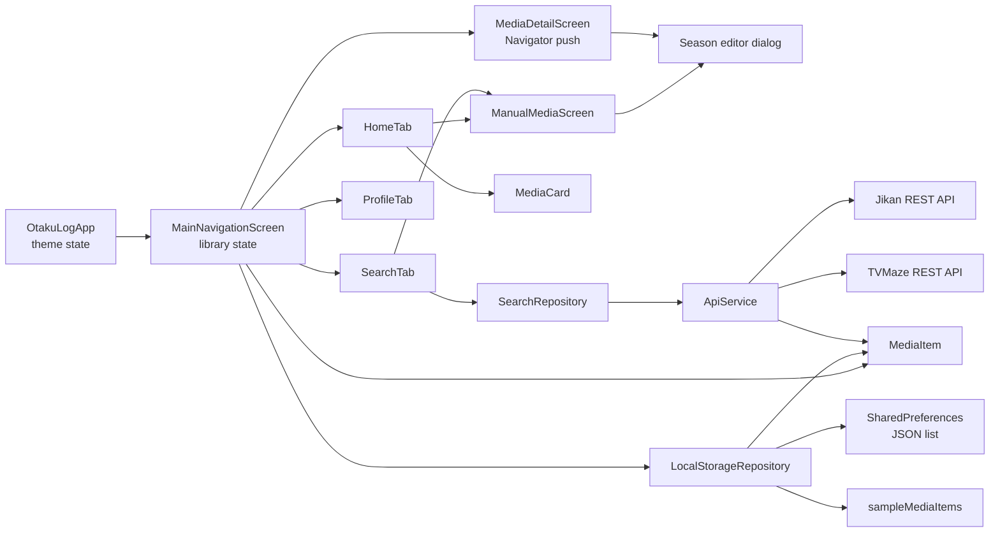
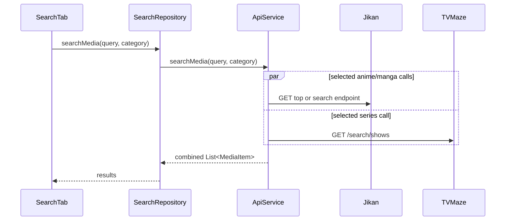

# Architecture

## Summary

OtakuLog uses a lightweight layered structure with Flutter widgets at the top,
repository classes as access boundaries, one HTTP service, one persistence
repository, and one shared model. State is held in `StatefulWidget` objects and
passed through constructor callbacks. There is no separate domain layer,
state-management package, router, or dependency-injection container.

## Presentation and state

### Current approach

- `OtakuLogApp` owns `ThemeMode`.
- `MainNavigationScreen` owns the current tab, loading state, and in-memory
  library list.
- `HomeTab` owns its local filter and search text.
- `SearchTab` owns its query controller, selected category, debounce timer,
  results, loading, and error fields.
- `MediaDetailScreen` owns an editable copy of selected item fields and its
  active flat/seasonal progress mode.
- `ManualMediaScreen` owns a focused creation form and returns one complete
  `MediaItem` through the same root add callback used by Explore results.
- Child-to-parent changes use callbacks.

### Extension pattern

For small changes, keep state with the widget that owns the behavior and pass
dependencies through constructors. When behavior crosses screens, first
extend the existing repository/root callback flow. A state-management package
requires an explicit architectural decision; do not introduce one inside a
single feature.

### Restrictions

- Do not create global mutable state or a parallel service locator.
- Preserve constructor injection seams used by tests:
  `ApiService(http.Client?)`, `SearchRepository(ApiService?)`,
  `SearchTab(SearchRepository?)`, and
  `MainNavigationScreen(LocalStorageRepository?)`.

## Domain and models

`MediaItem` is both the domain-facing UI model and persistence/API mapping
target. It supports anime, manga, series, and movies; nullable totals;
separate user tracking and release status; flat or seasonal progress; manual
origin; optional synopsis; and rating. `MediaSeason` owns one stable season ID,
positive number, optional name, progress, nullable total, and release status.

For flat mode, the flat progress fields are authoritative. For seasonal mode,
the season list is authoritative and aggregate getters derive current/total
progress. JSON keeps aggregate values in the legacy `currentProgress` and
`totalCount` keys for older readers and retains inactive flat snapshots only
to make progress-mode conversion reversible. UI/business logic must use the
active getters rather than treating both representations as authoritative.

Tracking status remains string-compatible at the constructor/JSON boundary,
while centralized enum parsing provides validated business/UI semantics.
Release status and progress mode are stored as enums with tolerant string
decoding.

There is no separate entity/DTO distinction or validation layer. Extend
`MediaItem` only after checking API mapping, stored JSON compatibility, sample
data, cards, detail UI, and tests.

## Data layer

### Remote

`SearchRepository` delegates directly to `ApiService`. `ApiService` builds
public URLs, runs concurrent requests with `Future.wait`, decodes JSON, and
maps provider records into `MediaItem`.

All service exceptions and non-200 responses become an empty list. There are
no custom error types, authentication, headers, interceptors, retry, timeout,
pagination, or response cache.

### Local

`LocalStorageRepository` stores the entire library as one JSON string under
`otaku_log_media_items`. Empty/missing/invalid data falls back to
`sampleMediaItems` and is saved immediately.

Incrementing is never clamped to a known total and never changes tracking
status. Flat items increment directly. Seasonal card increments use the
highest-numbered ongoing season; an explicit season ID may be supplied by
other callers. Movies and seasonal items without a clear ongoing target are
left unchanged.

There is no local database schema, migration system, secure storage, or Hive
usage. Do not add a second store beside SharedPreferences. A persistence
replacement needs an explicit migration decision and backward-compatibility
plan.

## Navigation

- Root: `MaterialApp.home`
- Primary navigation: `BottomNavigationBar` + `IndexedStack`
- Detail/manual navigation: imperative
  `Navigator.push(MaterialPageRoute(...))`
- Named routes/deep links: not implemented

Add a screen by following the existing callback and `MaterialPageRoute`
pattern unless route scale or a task explicitly justifies a router decision.

## Dependency injection

There is no container. Optional constructor parameters provide manual
injection, and defaults construct production dependencies. Preserve this
pattern for testability.

## Error handling

- API errors: swallowed and represented as empty results.
- Persistence decode errors: swallowed and replaced with sample data.
- Image errors: render a type icon fallback.
- Loading: root spinner for local load and Explore spinner for remote search.
- Save/delete errors: not surfaced.

Any error-model change affects service, repositories, screens, and tests and
must be documented as a decision.

## Configuration and environments

Base URLs are static constants in `ApiService`. There are no flavors,
`--dart-define` keys, environment files, or secret-bearing configuration.
Public API URLs are the only remote configuration.

## Theme, localization, and accessibility

`AppTheme` defines two Material 3 `ThemeData` instances and a partial set of
color/radius constants. Theme mode is callback-driven and in memory.

Localization is absent. Text is embedded in widgets. Semantic labels are
mostly inherited from Material controls; no explicit accessibility standard,
text-scale validation, or focus-navigation test is present.

## Serialization and generated code

Serialization is handwritten in `MediaItem`. No code generator, generated Dart
model, ARB output, or build-runner configuration exists. Do not invent code
generation commands or edit Flutter-generated platform files manually.

## Authentication, background work, and notifications

Not implemented. There are no accounts, tokens, background jobs, push
services, notification permissions, or scheduled work. The Profile
notification and cloud-sync rows are placeholder affordances only.
