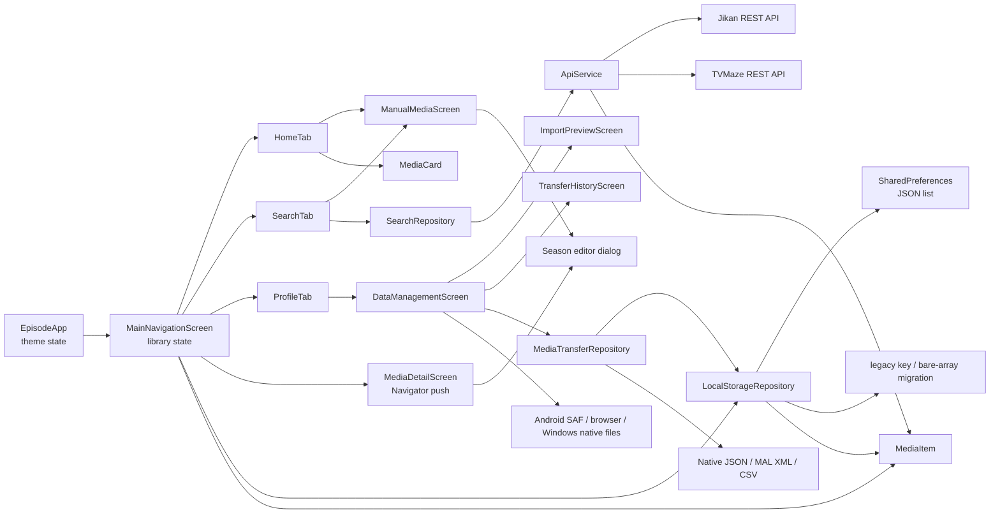
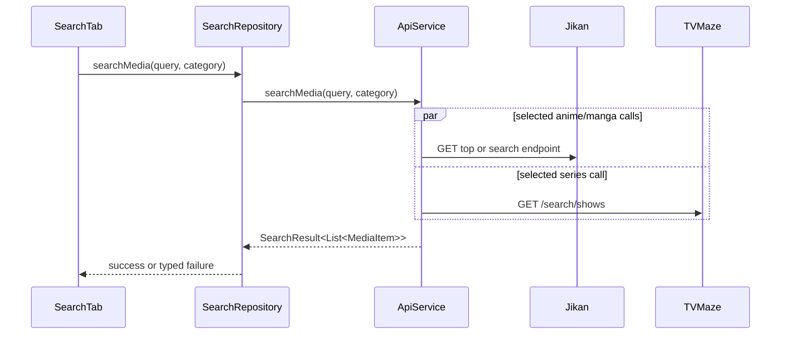

# Architecture

## Summary

Episode uses a lightweight layered structure with Flutter widgets at the top,
repository classes as access boundaries, one HTTP service, one persistence
repository, and one shared model. State is held in `StatefulWidget` objects and
passed through constructor callbacks. There is no separate domain layer,
state-management package, router, or dependency-injection container.

## Presentation and state

### Current approach

- `EpisodeApp` owns `ThemeMode`.
- `MainNavigationScreen` owns the current tab, loading state, and in-memory
  library list.
- `HomeTab` owns its local filter and search text.
- `SearchTab` owns its query controller, selected category, debounce timer,
  results, loading, and error fields.
- `MediaDetailScreen` owns an editable copy of selected item fields and its
  active flat/seasonal progress mode.
- `ManualMediaScreen` owns a focused creation form and returns one complete
  `MediaItem` through the same root add callback used by Explore results.
- `DataManagementScreen` owns transient operation-stage UI and delegates file
  I/O to `FileTransferService` and data rules to `MediaTransferRepository`.
- `ImportPreviewScreen` owns strategy/conflict selections over an immutable
  provider inspection; `TransferHistoryScreen` reads retained summaries and
  automatic safety backups.
- Child-to-parent changes use callbacks.

### Extension pattern

For small changes, keep state with the widget that owns the behavior and pass
dependencies through constructors. When behavior crosses screens, first
extend the existing repository/root callback flow. A state-management package
requires an explicit architectural decision; do not introduce one inside a
single feature.

### Restrictions

- Do not create global mutable state or a parallel service locator.
- Preserve constructor injection seams used by tests:
  `ApiService(http.Client?)`, `SearchRepository(ApiService?)`,
  `SearchTab(SearchRepository?)`, and
  `MainNavigationScreen(LocalStorageRepository?)`. The data screen similarly
  accepts repository and file-transfer overrides.

## Domain and models

`MediaItem` is both the domain-facing UI model and persistence/API mapping
target. It supports anime, manga, series, and movies; nullable totals;
separate user tracking and release status; flat or seasonal progress; manual
origin; optional synopsis; and rating. `MediaSeason` owns one stable season ID,
positive number, optional name, progress, nullable total, and release status.
Additive transfer metadata on `MediaItem` includes external IDs, notes, tags,
start/completion/add/update dates, repeat count, favorite state, and flexible
custom metadata. Missing legacy fields decode to safe empty/null defaults.

For flat mode, the flat progress fields are authoritative. For seasonal mode,
the season list is authoritative and aggregate getters derive current/total
progress. JSON keeps aggregate values in the legacy `currentProgress` and
`totalCount` keys for older readers and retains inactive flat snapshots only
to make progress-mode conversion reversible. UI/business logic must use the
active getters rather than treating both representations as authoritative.

Tracking status remains string-compatible at the constructor/JSON boundary,
while centralized enum parsing provides validated business/UI semantics.
Release status and progress mode are stored as enums with tolerant string
decoding.

`ImportedMediaEntry` is a provider-neutral boundary model used only during
inspection and planning. It prevents MAL/native-specific shapes from leaking
into widgets while preserving `MediaItem` as the only stored entity.

There is no separate persistent entity/DTO distinction. Extend
`MediaItem` only after checking API mapping, stored JSON compatibility, sample
data, cards, detail UI, and tests.

## Data layer

### Remote

`SearchRepository` delegates directly to `ApiService`. `ApiService` builds
public URLs, runs concurrent requests with `Future.wait`, decodes JSON, and
maps provider records into `MediaItem`.

Requests use an Episode user-agent, a ten-second timeout, and one retry for
transport failures and rate limiting. Provider errors map to typed network,
timeout, rate-limit, server, invalid-response, or unknown failures. Successful
results from any selected provider win over failures from the others. There is
no authentication, interceptor layer, pagination, request cancellation, or
response cache.

### Local

`LocalStorageRepository` stores the entire schema-v2 library envelope as one
JSON string under `episode_media_items`, with one-time fallback migration from
the legacy `otaku_log_media_items` key. If neither key exists, the library
starts empty. A valid empty library remains empty. Invalid/corrupt data throws
a visible storage error without overwriting the raw value.

Whole-library import/restore uses a one-key snapshot transaction: validate the
candidate, snapshot the previous JSON value, write the complete replacement,
decode and compare the round trip, and restore the snapshot on failure.
SharedPreferences is not an ACID database; atomicity here is the repository's
verified replacement/rollback contract.

The same repository stores the newest five automatic native safety backups
under `episode_automatic_backups_v1` and the newest 25 operation summaries
under `episode_transfer_history_v1`. On first access it migrates values from
the corresponding legacy `otaku_log_automatic_backups_v1` and
`otaku_log_transfer_history_v1` keys, then removes the old key after a
successful copy.

New automatic snapshots, including pre-sync snapshots, are encoded by
`NativeBackupCodec` and are directly restorable. When a retained snapshot from
the older local-envelope implementation is downloaded, `MediaTransferRepository`
converts that known shape to native backup v1 without mutating the stored copy.

Incrementing is never clamped to a known total and never changes tracking
status. Flat items increment directly. Seasonal card increments use the
highest-numbered ongoing season; an explicit season ID may be supplied by
other callers. Movies and seasonal items without a clear ongoing target are
left unchanged.

There is no database-level schema, secure storage, or Hive usage. Native backup
files have a separate explicit schema and migration chain; this does not change
the active SharedPreferences library format. Do not add a second store beside
SharedPreferences. A persistence replacement needs an explicit migration
decision and backward-compatibility plan.

### Import, export, and backup

`MediaTransferRepository` is the orchestration boundary. `ImportProvider` and
`ExportProvider` make formats extensible without branching in widgets. The
current providers implement native JSON, MAL anime/manga XML (including gzip
input), and CSV export. `ImportPlanner` performs external-ID/title matching,
strategy selection, conflict policy, safe merges, and full restore.

Every mutation follows inspect -> preview -> automatic safety backup -> plan ->
verified repository replacement -> result/history. Uncertain title matches are
reported and skipped. Native backups use schema v1 with SHA-256 integrity and
a v0 migration. Details are in [BACKUP_SCHEMA.md](BACKUP_SCHEMA.md).

Platform file I/O is isolated behind conditional adapters. Android uses one
MethodChannel backed by Storage Access Framework intents; web uses browser file
input and download APIs; Windows implements the same MethodChannel with native
open/save dialogs. Dart receives/saves byte arrays and does not construct
user-selected paths.

The internal MethodChannel identifier is `episode/file_transfer` on Android,
Windows, and Dart. It is not persisted user data; any future change must still
be coordinated atomically across all three implementations.

## Navigation

- Root: `MaterialApp.home`
- Primary navigation: state-preserving `IndexedStack` with
  `BottomNavigationBar` below 600 px, compact `NavigationRail` from 600 px, and
  extended rail from 1024 px
- Detail/manual/data/preview/history navigation: imperative
  `Navigator.push(MaterialPageRoute(...))`
- Named routes/deep links: not implemented

Add a screen by following the existing callback and `MaterialPageRoute`
pattern unless route scale or a task explicitly justifies a router decision.

## Responsive presentation

`ResponsiveLayoutInfo` centralizes the 600/1024/1440 intent breakpoints,
horizontal padding, max content widths, grid calculation, and two-pane
eligibility. `ResponsiveBuilder` derives layout from live parent constraints,
so navigation and screens adapt during window resizing without rebuilding the
application or losing tab state. Presentation code recomposes existing widgets;
repositories, auth, sync, storage, and transfer rules do not depend on viewport
size.

## Dependency injection

There is no container. Optional constructor parameters provide manual
injection, and defaults construct production dependencies. Preserve this
pattern for testability.

## Error handling

- API errors: typed and visible when every selected provider fails; partial
  provider failures remain hidden when another provider succeeds.
- Persistence decode errors: surfaced without overwriting raw data; the shell
  provides retry/recovery guidance.
- Transfer errors: typed/redacted user messages, no mutation before preview,
  snapshot rollback for failed writes, and retained result summaries.
- Image errors: render a type icon fallback.
- Loading: root spinner for local load and Explore spinner for remote search.
- Save/delete errors: not surfaced.

Any error-model change affects service, repositories, screens, and tests and
must be documented as a decision.

## Configuration and environments

Discovery URLs are static constants in `ApiService`. There are no flavors,
environment files, or secret-bearing source configuration. Optional account
and sync requests use the `EPISODE_API_BASE_URL` compile-time define through
`AppConfig`.

## Theme, localization, and accessibility

`AppTheme` defines two Material 3 `ThemeData` instances and a partial set of
color/radius constants. Theme mode is callback-driven and in memory.

Localization is absent. Text is embedded in widgets. Semantic labels are
mostly inherited from Material controls; no explicit accessibility standard,
text-scale validation, or focus-navigation test is present.

## Serialization and generated code

Serialization is handwritten in `MediaItem` and the transfer models. Native
backup schema/migration code is handwritten and tested. No code generator,
generated Dart model, ARB output, or build-runner configuration exists. Do not
invent code-generation commands or edit Flutter-generated registrant output.

## Authentication, background work, and notifications

Optional account authentication, refresh-token rotation, secure token storage,
device identity, and snapshot sync are implemented. They are additive to the
offline local library and activate only when `EPISODE_API_BASE_URL` is
configured. No background scheduler, push notifications, or MyAnimeList OAuth
flow is implemented.
